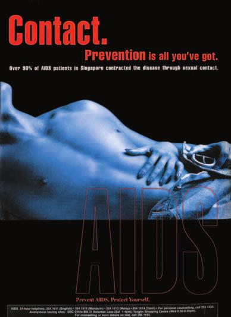
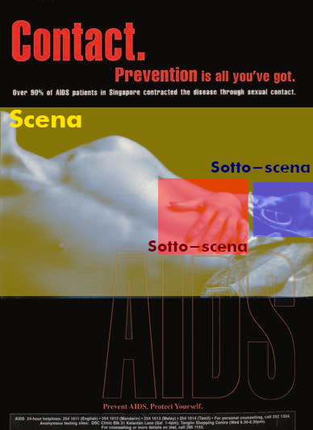

# Il linguaggio e la grammatica delle immagini

## La nostra Classroom
Questo webinar fa parte di una programmazione più ampia, dedicata all’interazione tra linguistica e didattica in classe, e pensata per condividere e sviluppare attività, idee, suggerimenti, e per instaurare uno scambio di esperienze e necessità. Per questo abbiamo creato una piattaforma di discussione online: puoi accedere alla stanza dedicata di <a href="https://classroom.google.com/u/0/" target="_blank">Google Classroom</a>, utilizzando il codice **jdibcze**.
Speriamo che questa diventi un punto di incontro tra tutte le competenze fin qui coinvolte, per poterci scambiare opinioni sulle attività e proposte inedite per temi, metodi e strumenti di lavoro a scuola. 

## Multimodalità: che cosa significa?
In semiotica, il termine **multimodale** si riferisce alle diverse modalità di comunicazione che vengono utilizzate - spesso in interazione tra loro - per la costruzione di significato. La capacità di interpretare correttamente un messaggio e di trasmetterne il contenuto non si misura quindi su un piano puramente verbale: basti pensare alle immagini, siano esse statiche o in movimento, e alle loro diverse funzioni comunicative, ma anche ad altri tipi di comunicazione che tengono conto di elementi non verbali come la **prossemica** e lo studio dei gesti. In *Introducing Multimodality* (2016), gli studiosi Bezemer, Jewitt e O’Halloran evidenziano i tre elementi chiave della multimodalità:

> 1. Il significato è costruito con differenti risorse semiotiche, ognuna delle quali presenta potenzialità e limitazioni
2. La costruzione di significato implica la produzione di unità multimodali tra loro indipendenti
3. Nello studio del significato, si devono prendere in considerazione tutte le risorse semiotiche utilizzate (Bezemer et al. 2016: 3)

La coesistenza e talvolta la sovrapposizione di molteplici modalità di rappresentazione portano dunque alla creazione di messaggi sempre più articolati e complessi, che necessitano di essere *scomposti* per poter essere analizzati e interpretati. Tutti i sistemi **semiotici**, indipendentemente dalla loro modalità di rappresentazione, hanno in comune quelle che il linguista Michael Halliday in *Introduction to Functional Grammar* (2014) definisce **metafunzioni**: 

* **Ideativa**: il modo in cui il linguaggio rappresenta il mondo e l’esperienza extra-linguistica
* **Interpersonale**: è l’aspetto sociale della lingua, e indica il modo in cui il linguaggio viene utilizzato per stabilire relazioni ed esprimere attitudini e opinioni
* **Testuale**: la strutturazione del messaggio comunicativo in termini di coesione e coerenza

Le metafunzioni rappresentano quindi le componenti base di ogni linguaggio (sia esso verbale, visivo, cinetico) e possono essere a loro volta scomposte in ulteriori categorie di analisi. Nella sezione successiva, vedremo più nel dettaglio come  applicare le categorie di analisi linguistica ai linguaggi non verbali, e in particolare ci concentreremo sullo studio di immagini.

## Una *grammatica* delle immagini
Così come esiste una **grammatica del testo** - intesa come insieme di regole condivise da una comunità di parlanti in un dato momento - che ci permette di identificarne la struttura a partire da elementi come la coesione e la coerenza (*metafunzione testuale*), così anche le immagini possono essere analizzate secondo queste stesse caratteristiche. Saper applicare delle vere e proprie “regole” grammaticali all’analisi di linguaggi visivi ci permette inoltre di affinare la nostra consapevolezza linguistica migliorando al contempo le competenze comunicative, soprattutto in un contesto come quello odierno sempre più caratterizzato dalla coesistenza di diversi *media* e diverse modalità di rappresentazione semiotica.

## Un *discorso* delle immagini
Si intende per *discorso* quell’insieme di caratteristiche che legano un testo o un’immagine ad un contesto situazionale - si parla infatti di *situated meanings* ≈ significati contestuali. Analizzare il *discorso* significa dunque analizzare quei significati “sociali” creati attraverso la grammatica, e collegarli a quelle caratteristiche/dinamiche sociali nei quali si situano. La relazione *discorso* - *grammatica* è biunivoca, pertanto l’uno influenza l’altra e viceversa. 

## Come analizzare un’immagine
> Questa sezione è un adattamento dei materiali e attività contenute in O’Halloran (2008).

<table class="tg">
<thead>
  <tr>
    <th class="tg-baqh" rowspan="5">Contenuto</th>
    <th class="tg-uqo3">Lingua</th>
    <th class="tg-uqo3">Dimensione visuale</th>
  </tr>
  <tr>
    <td class="tg-baqh" colspan="2">Discorso</td>
  </tr>
  <tr>
    <td class="tg-8zwo">Discorso</td>
    <td class="tg-0lax">Relazioni intervisuali: cosa ti fa venire in mente questa immagine? quali sono gli elementi che vedi nell’immagine? Ci sono elementi  “paratestuali” che non appartengono all’immagine che ti aiutano a capirne il significato?  Opera: come sono combinati i diversi elementi per creare un’unità dotata di significato?</td>
  </tr>
  <tr>
    <td class="tg-uqo3" colspan="2">Grammatica</td>
  </tr>
  <tr>
    <td class="tg-0lax">Periodo  Frase  Predicato  Parola </td>
    <td class="tg-0lax">Scena: quale sequenza di movimento-azione-evento compongono gli oggetti?  Sotto-scene: ’immagine può essere scomposta in “mini” scene indipendenti?  Figura: quali oggetti/elementi sono presenti nell’immagine?  Parte: quali elementi delle figure sono visibili?</td>
  </tr>
</thead>
<tbody>
  <tr>
    <th class="tg-baqh" rowspan="2">Aspetto</th>
    <td class="tg-uqo3" colspan="2">Materialità</td>
  </tr>
  <tr>
    <td class="tg-0lax" colspan="2">Caratteristiche tipografiche/grafologiche e grafica  Ad es. come sono usati i colori? Sono usati materiali diversi per evidenziare aspetti diversi dell’immagine? Come sono usate la prospettiva e l’inquadratura?</td>
  </tr>
</tbody>
</table>

## Esempio d'analisi

L’immagine riproduce una “pubblicità progresso” pubblicata nel 1998 nella rivista *Cleo* (Singapore). Di seguito viene indicato come completare l’esercizio di analisi seguendo le indicazioni riportate nella tabella. I materiali sono tratti da O'Halloran 2008.

|             |                          |                                                                                                                                                                                          |
|-------------|--------------------------|------------------------------------------------------------------------------------------------------------------------------------------------------------------------------------------|
| Discorso    |                          |                                                                                                                                                                                          |
|             | Relazioni intervisuali   | 1. Altre pubblicità progresso 2. Altre pubblicità (ad es. Denim "per l'uomo che non deve chiedere mai" 3. Rapporti eterosessuali                                                         |
|             | Opera                    | Pubblicità progresso, con un messaggio sociale dato dall'interazione dei diversi elementi (immagine e testi)                                                                             |
| Grammatica  |                          |                                                                                                                                                                                          |
|             | Scena                    | Intimità rappresentata in maniera "pericolosa"                                                                                                                                           |
|             | Sotto-scene              | 1. Mano di donna sul corpo dell'uomo 2. Mano dell'uomo che si slaccia la cintura                                                                                                         |
|             | Figura                   | 1. Uomo 2. Donna                                                                                                                                                                         |
|             | Parte                    | 1. Mano della donna con unghie smaltate                                                                                                                                                  |
| Materialità |                          |                                                                                                                                                                                          |
|             | Caratteristiche grafiche | 1. Uso del colore rosso per il titolo; per attrarre l'attenzione? 2. Uso del colore blu per indicare qualcosa di "innaturale" e potenzialmente pericoloso (la pelle umana non è mai blu) |

## Per approfondire
### VisMet: Corpus of Visual Metaphors
Il progetto **VisMet** nasce in collaborazione con il Metaphor Lab dell’Università di Amsterdam ed è una raccolta interattiva di metafore visuali individuate a partire dall’analisi di diverse tipologie di immagini, tra cui cartelloni pubblicitari, graffiti, vignette satiriche e fumetti. Lo <a href= "http://www.vismet.org/VisMet/annotation.php" target="_blank"> schema di annotazione </a>
utilizzato per l’identificazione delle metafore si basa sull’individuazione dei due domini concettuali e su come essi vengono rappresentati all’interno dell’immagine. Per chi desiderasse saperne di più, vi invitiamo a visionare direttamente il <a href= "http://www.vismet.org/VisMet/display.php" target="_blank"> sito del progetto </a> e a curiosare tra le oltre trecento immagini raccolte. 
E se volete proporre ai vostri studenti altre attività sulle metafore, vi suggeriamo questa <a href= "http://visualmetaphor.com/index.php" target="_blank"> piattaforma </a> che permette di combinare i più svariati elementi visivi per la creazione di metafore originali.

## Riferimenti
Bezemer, Josephus Johannes, Carey Jewitt, and Kay L. O’Halloran. 2016. *Introducing Multimodality*. London ; New York: Routledge.  
Gee, James Paul, and Michael Handford, eds. 2012. *The Routledge Handbook of Discourse Analysis*. Routledge Handbooks in Applied Linguistics. London ; New York: Routledge.  
Halliday, M.A.K. 2014. *Introduction to Functional Grammar*. London ; New York: Routledge.  
O’Halloran, Kay L . 2008. ‘Systemic Functional-Multimodal Discourse Analysis (SF-MDA): Constructing Ideational Meaning Using Language and Visual Imagery’. *Visual Communication* 7 (4): 443–75. <a href="https://doi.org/10.1177/1470357208096210" rel="" target="_blank">Link all’articolo.</a>  
<a href="http://www.insegnareonline.com/rivista/cultura-ricerca-didattica/strada-tesi-prospettiva-multimodale" rel="" target="_blank">Sulla strada delle Dieci Tesi in prospettiva multimodale</a>
